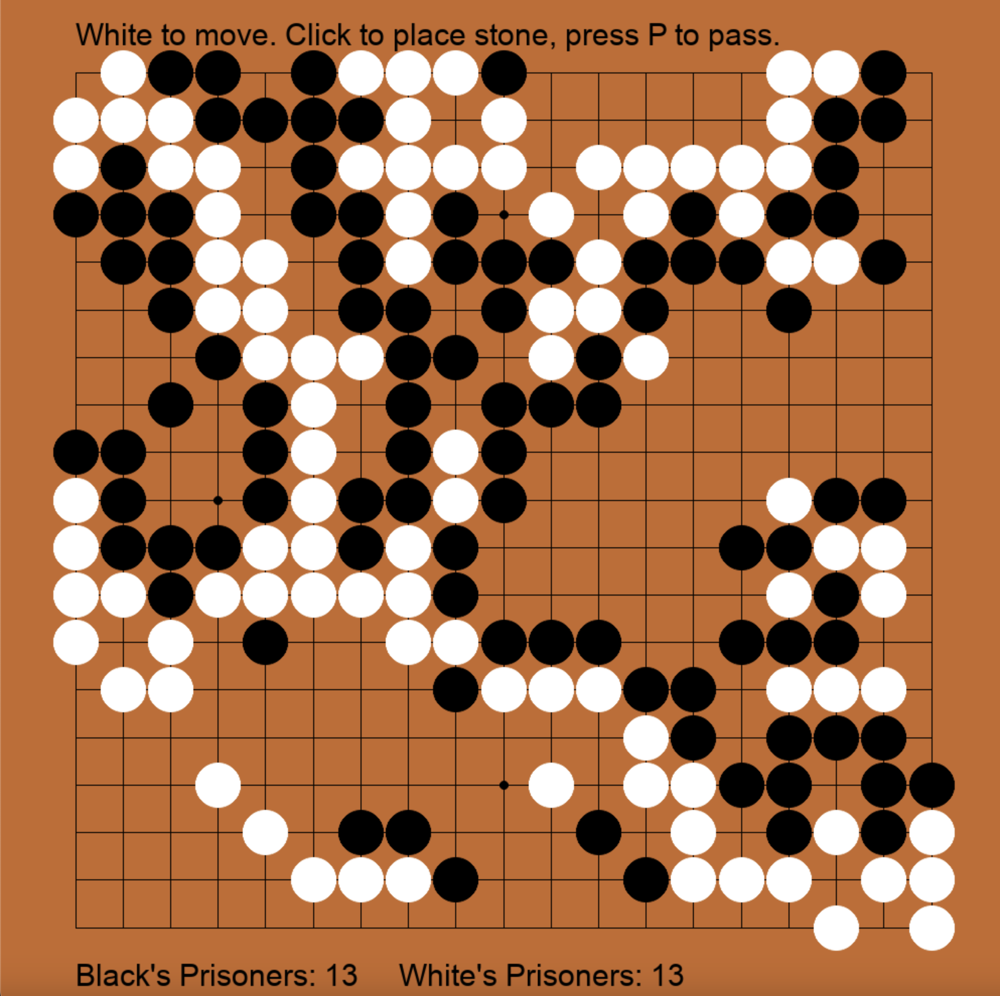

GoTimeTravel visualizes how the ancient game of Go has evolved over time by showing the different moves preferred by models trained from top professional games from 1600s to today given a specific board position.

# Dataset
To train the models, we use the [Professional Go Dataset (PGD)](https://github.com/wangjinzhuo/pgd) which contains over 250k games played by professional Go players from 1600s to 2017. We parse the SGF files and generate training data points consisting of a pair of (board, move). 

The dataset is divided into 4 eras : 1) 1600s-1938 2) 1939-1989 3) 1989-2015 4) 2016-Present
based on the history of Go. We train separate neural networks on the data from each era to capture the evolution of preferred moves over time.

# Model 
## Baseline 
First, we need a baseline model to play Go. Training a AlphaGo-like model from scratch would be prohibitive as AlphaGo was trained with 50 GPUs for 3 weeks.  Meanwhile, [a simple CNN model]() is not sufficient to be a baseline since it only perceives the game superficially as a 2D spatial pattern without "playing out" possible moves. I tried it out in the hope that such a small model is enough to mimic moves in the dataset. Turns out the model has no understanding of the rules and would play illegally. So I chose a pre-trained open source model named [katago](https://arxiv.org/pdf/1902.10565.pdf) which is an efficient yet strong deep learning model maintained with an active community. Among the [released katago model checkpoints](https://katagotraining.org/networks/), I picked the roughly AlphaZero-sized(around 28M parameters) b18c384nbt network which can be easily loaded with pytorch elo rating and achieves 13633 elo rating on 19x19 board.

To see if the model works, let's load the model under `/models/katago/kata1-b18c384nbt-s7041524736-d3540025399/model.ckpt` and have it play against itself.
After plugging the model into [a pygame implementation of Go](https://github.com/thomashikaru/gogame), it plays a really legit game!

[To try it for youself, you can head to https://xethub.com/keltonzhang/GoTimeTravel/capsules/branch/main and launch the game with XetHub's Capsule without installing anything or cloning my repo locally.]: #

## Finetuning
Then, we need to finetune the katago model with our games in the dataset. 
Katago is supposed to be trained with multiple objectives including win rate, territory etc in the form of npz files. Yet we only have sgf files for our dataset. Generating the in-game statistics for training is theoratically feasible but not necessary for our goal of updating the model weights to styles of different eras. So I decided to simply finetune the katago model with cross-entropy loss on the sgf moves.

[You can train the model yourself on this colab notebook https://colab.research.google.com/drive/1ZtP9WcePKU0XTYYGtr4HdGr4rEY-SdcC?usp=sharing]: #
